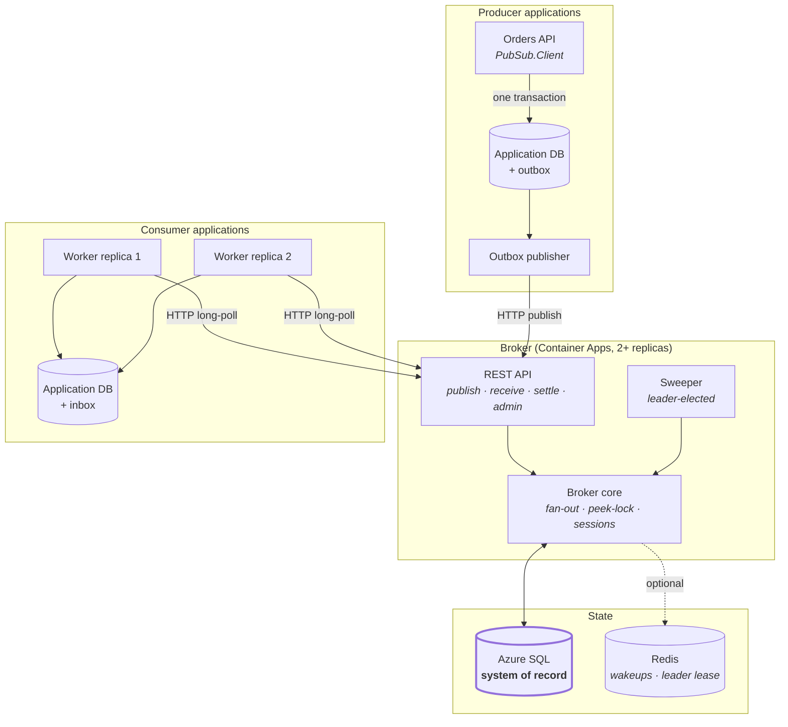
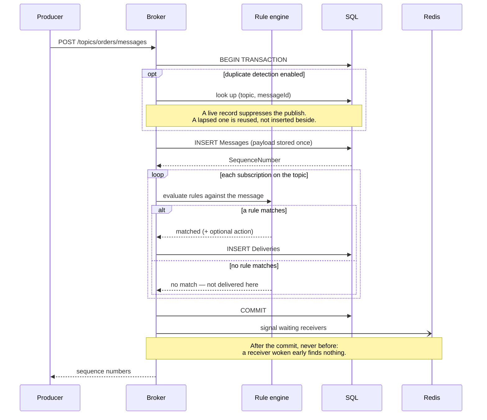
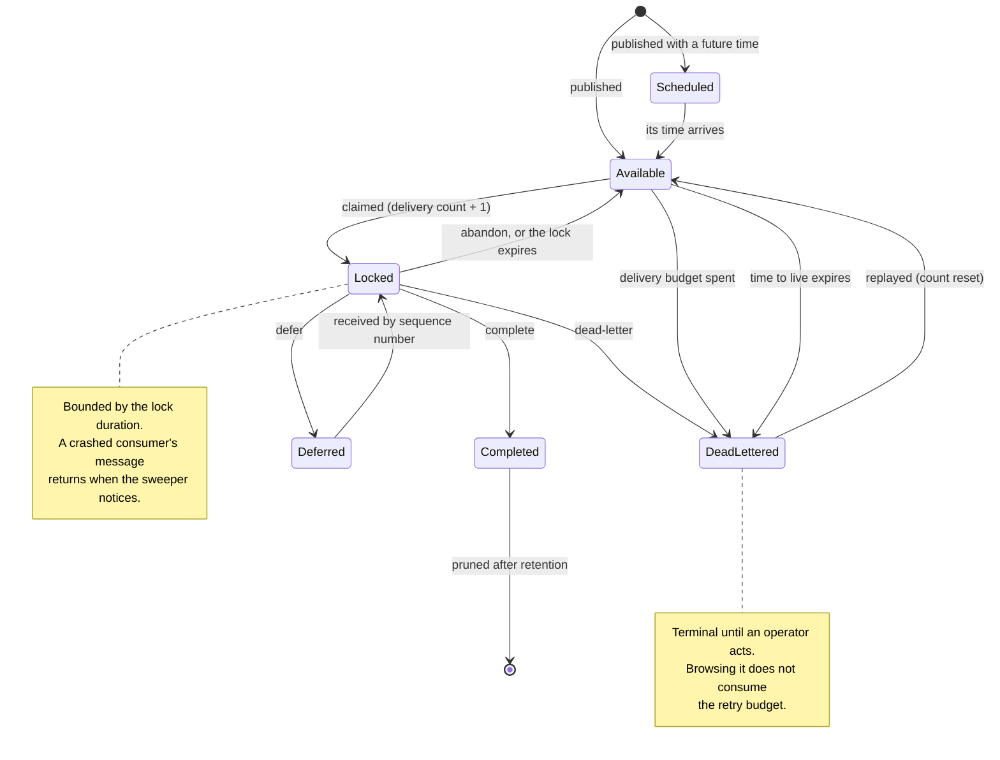
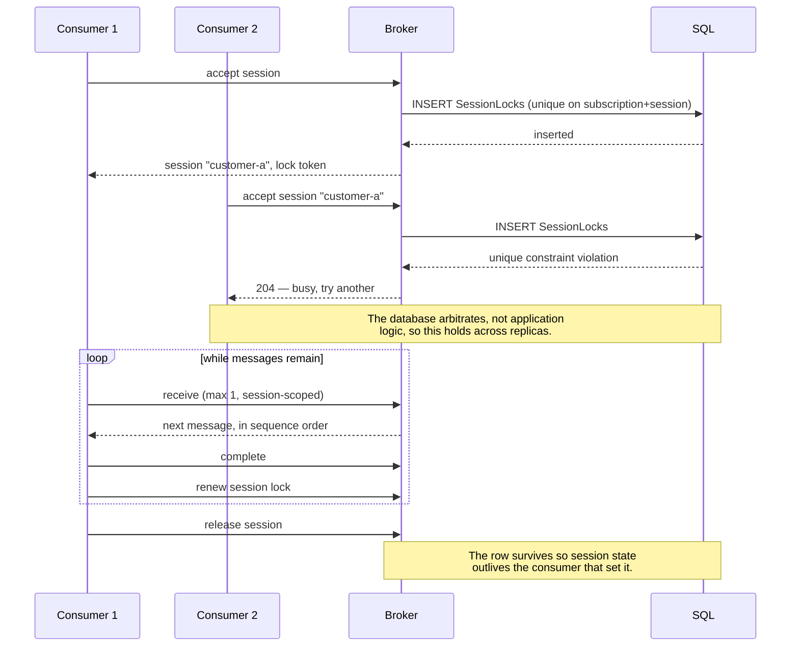
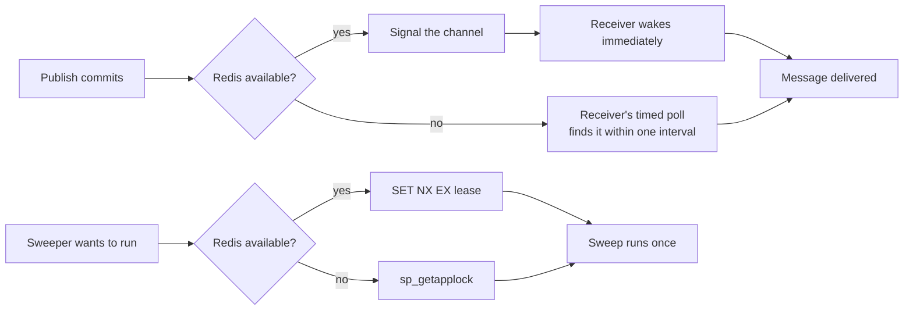

# Architecture

A publish/subscribe message broker built on Azure's non-messaging primitives. See
[ADR 1](adr/0001-build-our-own-broker.md) for why it is built rather than bought.

## Component topology

SQL is authoritative for everything. Redis is drawn with a dashed edge because the broker runs
correctly without it — see [ADR 7](adr/0007-redis-is-optional-by-design.md).

## Publish and fan-out

A publish stores the payload **once** and creates one delivery row per matching subscription
([ADR 5](adr/0005-shared-message-row-per-subscription-delivery.md)).

The whole batch is atomic. Because the connection retries transient faults, the transaction runs
inside EF's execution strategy — otherwise a retry could resume mid-transaction and commit half a
batch.

## Peek-lock: the delivery state machine

An expired lock **does not** reset the delivery count. The attempt was made and did not settle, so
it counts — otherwise a consumer that reliably crashes mid-message would retry forever instead of
eventually dead-lettering.

The claim itself is one atomic statement; [ADR 6](adr/0006-peek-lock-via-readpast-claim.md)
explains each lock hint and what breaks without it.

## Sessions: ordering through exclusivity

Ordering comes from exclusivity: only the lock holder may claim that session's deliveries, so its
messages are handled one at a time. Concurrency is **across** sessions, never within one — a
session key too coarse (per tenant rather than per entity) serialises far more than intended.

## Redis and its fallbacks

Both paths reach the same outcome; only latency differs. Redis pub/sub is fire-and-forget, so a
signal published during a reconnect is simply lost — which is survivable precisely because nothing
depends on it.

## Projects

| Project | Responsibility |
| --- | --- |
| `PubSub.Abstractions` | Envelope, publisher and handler contracts, filters, exceptions. No dependencies. |
| `PubSub.Filters` | Tokenizer, parser, and closure-compiled evaluator for the filter language. |
| `PubSub.Broker.Core` | EF Core model, publish fan-out, the peek-lock claim, settlement, sessions, sweeper. |
| `PubSub.Broker.Redis` | Optional wakeups and leader election. Degrades to the core's defaults. |
| `PubSub.Broker.Api` | HTTP surface, authentication, OpenAPI, health, observability. |
| `PubSub.Client` | `IEventPublisher`, the processor pump, lock renewal, trace propagation. |
| `PubSub.Outbox` | Transactional outbox and inbox deduplication over EF Core. |

## Where the guarantees live

| Guarantee | Enforced by |
| --- | --- |
| One receiver per message | `UPDLOCK` in the claim statement |
| Competing consumers scale | `READPAST` in the claim statement |
| A crashed consumer's work returns | Lock expiry plus the sweeper |
| A poison message stops eventually | Delivery count against the subscription's budget |
| Ordering within a key | A unique index on `(SubscriptionId, SessionId)` |
| A batch is all or nothing | One transaction inside EF's execution strategy |
| A producer's retry is not a second message | Duplicate detection on `MessageId` |
| Data change and announcement share a fate | The outbox, committed with the caller's transaction |
| Reprocessing has no extra effect | The inbox's unique constraint, or natural idempotency |

Every row is covered by a test that fails if the mechanism is removed. See
[`reliability.md`](reliability.md).
