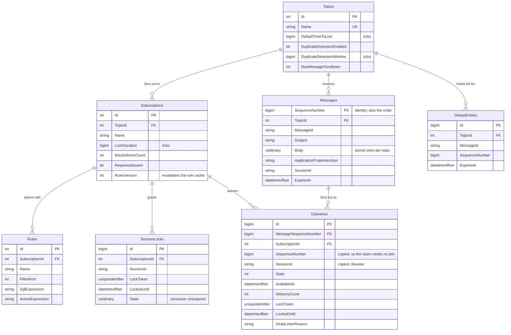

# Data model

Seven tables. SQL is the system of record for all of it
([ADR 2](adr/0002-sql-as-system-of-record-redis-as-hot-path.md)).

## Design decisions visible in the schema

**Durations are stored as ticks in `bigint`, not as SQL `time`.** `time` represents a time of day
and caps just under 24 hours, so an ordinary 14-day default time to live overflows on insert. This
was found by running the code, not by reading it.

**`Messages.SequenceNumber` is an identity column.** That makes it monotonic in publish order,
which is what session ordering and deferred retrieval both rely on. It is the primary key as well
as the sequence, so no separate counter exists to drift.

**`Deliveries` denormalises `SequenceNumber` and `SessionId`.** Both are copied from the message so
the claim query — the hottest in the system — can filter and order without touching `Messages`.

**`Deliveries.SubscriptionId` does not cascade.** `Topics` would otherwise reach `Deliveries` by
two paths, through `Messages` and through `Subscriptions`, which SQL Server rejects outright. The
message path keeps its cascade because pruning relies on it; deleting a subscription clears its
deliveries explicitly, which is a rare admin operation.

**`Subscriptions.RulesVersion` exists to invalidate a cache.** Compiling filters is the expensive
half of routing and rules change rarely, so compiled rule sets are cached and keyed on this. An
admin change bumps it, which invalidates the entry on every broker instance — including instances
that never saw the change — without anyone comparing rule text.

**`Deliveries.OverriddenPropertiesJson` is usually null.** A rule action rewrites properties for
one subscription only; the common case has no action and stores nothing extra.

## Indexes and what they serve

| Index | Serves |
| --- | --- |
| `IX_Deliveries_Claim` on `(SubscriptionId, State, AvailableAt, SequenceNumber)` | The claim query. Its predicate and its ordering are both covered, so the `TOP (n)` scan stops as soon as it has enough rows instead of sorting the backlog |
| `IX_Deliveries_SessionClaim` on `(SubscriptionId, SessionId, State, SequenceNumber)` | The same claim, narrowed to one session |
| `IX_Deliveries_LockExpiry` on `(State, LockedUntil)` | The sweeper finding expired locks without scanning live rows |
| `IX_Deliveries_Expiry` on `(State, ExpiresAt)` | Time-to-live sweeps |
| `IX_Deliveries_Settled` on `(SubscriptionId, State, SettledAt)` | Dead-letter listing and pruning of settled rows |
| `IX_Deliveries_Sequence` on `(SubscriptionId, SequenceNumber)` | Retrieving deferred messages |
| `UX_SessionLocks_Session` on `(SubscriptionId, SessionId)` | **Session exclusivity.** Not an optimisation — this constraint is what arbitrates two consumers racing to accept one session |
| `UX_DedupEntries_MessageId` on `(TopicId, MessageId)` | **Duplicate suppression.** Likewise a correctness constraint, not a lookup aid |

The two unique indexes are load-bearing. Enforcing exclusion by constraint rather than by reading
first is what closes the window in which two concurrent operations both find nothing and both
proceed.

## Delivery states

| Value | State | Meaning |
| --- | --- | --- |
| 0 | `Available` | Claimable once `AvailableAt` has passed |
| 1 | `Locked` | Held by a receiver until `LockedUntil` |
| 2 | `Completed` | Settled; pruned after retention |
| 3 | `Deferred` | Set aside; reachable only by sequence number |
| 4 | `DeadLettered` | Terminal until replayed |

The dead-letter queue is not a separate table — it is the deliveries whose state is `DeadLettered`.
Reading it hands out ordinary peek-locks, so a replay tool settles exactly like a normal receiver.

## Growth and pruning

The sweeper prunes:

- **completed deliveries** past `CompletedRetention` (an hour by default, kept briefly so operators
  can confirm a message really was processed);
- **messages** whose deliveries have all gone — never before, so pruning cannot strip the payload
  out from under a delivery still in flight;
- **duplicate-detection records** past their window.

Dead-lettered deliveries are **never** pruned automatically. They are the record of what went
wrong, and deleting them on a timer would erase the evidence before anyone looked.

## Application-side tables

`PubSub.Outbox` adds two tables to the *application's* database, not the broker's:

| Table | Purpose |
| --- | --- |
| `OutboxMessages` | Publish intents staged in the application's own transaction |
| `InboxMessages` | Markers recording which messages a consumer has processed |

They live in the application's database on purpose: that is the only way the outbox row and the
data change it accompanies can share a transaction.
