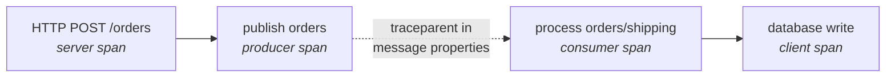

# Observability

A message's story is split across processes: published by one service, brokered, handled by
another. Traces are the only view that reassembles it, which is why trace context travels with the
message rather than stopping at the publish call.

## Tracing

The client injects W3C `traceparent` and `tracestate` into a message's application properties on
publish, and extracts them on consume to link the handler's span to the publisher's. Without that,
the publish and the consume appear as two unrelated traces and the question people actually ask —
*what happened to this message?* — has no answer.



The dashed edge crosses a process boundary and, in production, several minutes.

### Registering the sources

```csharp
builder.Services.AddOpenTelemetry()
    .WithTracing(t => t
        .AddSource(PubSubDiagnostics.ActivitySourceName)   // "PubSub.Client"
        .AddAspNetCoreInstrumentation()
        .AddHttpClientInstrumentation())
    .WithMetrics(m => m.AddMeter(PubSubDiagnostics.MeterName));
```

The broker registers the **client's** source alongside its own, so a span from either side lands in
the same trace.

Health probes are filtered out of tracing. They fire constantly and say nothing about message flow;
tracing them buries the spans that matter.

### Span attributes

Following OpenTelemetry's messaging conventions:

| Attribute | On |
| --- | --- |
| `messaging.system` | Both. Always `pubsub` |
| `messaging.operation.name` | `publish` or `process` |
| `messaging.destination.name` | The topic |
| `messaging.pubsub.subscription` | Consumer spans |
| `messaging.message.id` | Consumer spans |
| `messaging.pubsub.delivery_count` | Consumer spans — **above 1 means a redelivery** |

`delivery_count` is the attribute worth building a view on. A trace showing it climbing is a message
on its way to the dead-letter queue.

## Metrics

| Instrument | Type | Records |
| --- | --- | --- |
| `pubsub.client.published` | Counter | Messages accepted by the broker |
| `pubsub.client.received` | Counter | Messages handed to a handler |
| `pubsub.client.settled` | Counter | Settlements, tagged `complete`/`abandon`/`dead-letter`/`defer` |
| `pubsub.client.handler_failures` | Counter | Handler exceptions, tagged by type |
| `pubsub.client.handler.duration` | Histogram | Time spent in a handler, in milliseconds |

### What to alert on

**Handler duration approaching the lock duration.** This is the most valuable signal in the set,
because it is the earliest. The failure chain runs: duration approaches the lock, locks expire,
messages are redelivered, the delivery budget is spent, messages dead-letter. Alerting on the first
link gives time to react before any of the rest happens.

**Sustained abandons.** `settled{settlement="abandon"}` rising means handlers are failing
repeatedly, usually because something downstream is unwell.

**Dead-letter queue depth.** Any sustained growth needs a human. Nothing prunes it automatically —
deliberately, since it is the record of what went wrong.

**Received minus settled.** A persistent gap means messages are being claimed and neither completed
nor abandoned, which usually means handlers are hanging.

## Exporters

Both are optional, and instrumentation runs whether or not either is configured — a deployment that
has not chosen a backend is not a special case in the code.

**Application Insights**, when `APPLICATIONINSIGHTS_CONNECTION_STRING` is set. The Bicep templates
wire this automatically.

**OTLP**, when `OTEL_EXPORTER_OTLP_ENDPOINT` is set.

## Logging

Log messages use source generation (`[LoggerMessage]`) rather than the extension-method overloads,
because publish and receive run per message and the overloads box every argument whether or not the
level is enabled.

Event ids are grouped so a filter can select one subsystem: 1000–1999 broker core, 2000–2999
client, 3000–3999 outbox, 4000–4999 samples, 5000–5999 Redis.

Levels are chosen for what an operator should act on:

| Level | Used for |
| --- | --- |
| Debug | Suppressed duplicates, lapsed locks, pruning counts |
| Information | Dead-letter replays, sweeper actions, processor lifecycle |
| Warning | Dead-lettering after exhausted retries, Redis unavailable, session lock lost |
| Error | Handler failures, rule compilation failures, sweeper pass failures |

A Redis failure logs at Warning, not Error, and says so explicitly: dispatch falls back to polling
and correctness is unaffected. Logging it as an error would page someone for a latency change.

## Health

| Endpoint | Checks | Purpose |
| --- | --- | --- |
| `/health/live` | Process is running | Liveness probe |
| `/health/ready` | Database is reachable | Readiness probe |

Liveness deliberately ignores the database. Restarting the process would not fix a database outage,
and a liveness probe that checks it turns a brief blip into a restart loop — precisely when the
system is least able to absorb one.
